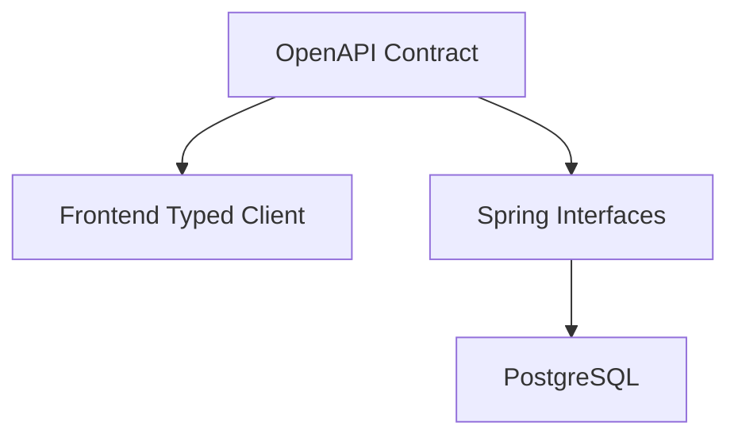

# Scaffolded Application

## What this is

- Contract-first monorepo with frontend, backend, and deployment config.



## Prerequisites

- mise / asdf / nvm, Docker, doctl, Ruby (for kamal via bundler)

## Getting started

```bash
mise install
pnpm install
pnpm dev
```

## Contract-first workflow

1. Edit `contract/openapi.yml`
2. Run `pnpm generate`
3. Implement backend methods
4. Use regenerated frontend client

## Running tests

- `pnpm test`
- `pnpm --filter frontend test`
- `pnpm --filter backend test`
- `pnpm test:e2e`

## Pre-commit checks (Lefthook)

- Lefthook is installed automatically on `pnpm install` via the `prepare` script.
- Every `git commit` runs individual lint and test commands in parallel via Lefthook.
- Autofix commands (`pnpm prettier:write`, `pnpm spotless:apply`, `pnpm lint:frontend:fix`) restage changed files automatically.
- If tests fail, the commit is blocked.

## Formatting

- `pnpm format`
- `pnpm lint`

## Editor setup

- VS Code: recommended extensions are listed in `.vscode/extensions.json`.
- VS Code: common workspace tasks are preconfigured in `.vscode/tasks.json` (install/lint/test/dev).
- VS Code/Copilot: Context7 MCP is preconfigured in `.vscode/mcp.json`.
- IntelliJ: import the project and install the **Save Actions** plugin for automatic format/import cleanup on save.
- IntelliJ: shared run configurations are included in `.idea/runConfigurations` for `pnpm dev`, `pnpm lint`, and `pnpm test`.
- IntelliJ/JetBrains: Context7 MCP config is included in `.idea/mcp.json`.
- Copilot CLI: Context7 MCP is preconfigured in `.copilot/mcp-config.json`.
- Kiro: Context7 MCP is preconfigured in `.kiro/mcp.json`.
- Kiro: workspace settings/tasks mirror VS Code behavior via `.kiro/settings.json` and `.kiro/tasks.json`.

## Deployment

- Push to `main` to trigger deployment workflow (`bundle exec kamal deploy`).
- The workflow publishes to GHCR with the repository-scoped `GITHUB_TOKEN` (`packages: write`).

## Preview Environments (Review Apps)

Opening a pull request automatically deploys a fully isolated preview stack:

- **URL pattern**: `https://pr-{number}.preview.{APP_HOSTNAME}` (or `http://pr-{number}.{IP}.sslip.io` without a custom domain)
- **Isolation**: each PR gets its own app containers and Postgres database
- **Cleanup**: the environment is destroyed when the PR is closed
- **PR comment**: the workflow posts/updates a comment with the preview URL

The preview uses a Kamal destination (`config/deploy.preview.yml`) deployed to the same droplet as production. By default, workflows resolve the droplet IP from `DROPLET_TAG` using `DO_API_TOKEN` and fall back to `DROPLET_IP`.

When `APP_HOSTNAME` is set, previews get auto-provisioned Let's Encrypt TLS certificates via kamal-proxy.

## Environment variables

| Variable                      | Description                                                 |
| ----------------------------- | ----------------------------------------------------------- |
| `OAUTH_CLIENT_ID`             | GitHub OAuth client ID                                      |
| `OAUTH_CLIENT_SECRET`         | GitHub OAuth client secret                                  |
| `ADMIN_GITHUB_USERNAMES`      | Comma-separated admin users                                 |
| `DO_API_TOKEN`                | DigitalOcean API token                                      |
| `KAMAL_REGISTRY_USERNAME`     | GHCR username                                               |
| `KAMAL_REGISTRY_PASSWORD`     | GHCR password                                               |
| `DROPLET_SIZE`                | DigitalOcean droplet size slug                              |
| `DROPLET_IP`                  | Deployment host IP                                          |
| `DROPLET_TAG`                 | Droplet tag for lookup (defaults to project/repo name)      |
| `DROPLET_SSH_PRIVATE_KEY_PATH`| Local SSH key path used to infer fingerprint for provisioning |
| `DROPLET_SSH_KEY_FINGERPRINT` | SSH key fingerprint for DigitalOcean droplet provisioning   |
| `DROPLET_SSH_PRIVATE_KEY`     | SSH private key contents (required for CI deploy/preview/teardown via Kamal) |
| `APP_HOSTNAME`                | Custom domain (optional; enables TLS + clean URLs)          |

## Admin setup

Set `ADMIN_GITHUB_USERNAMES=alice,bob`.

## Troubleshooting

- Port conflicts: free 3000/8080/5432.
- Docker not running: start Docker daemon.
- OAuth callback mismatch: confirm callback URLs.
- doctl auth error: run `doctl auth init`.
- mise not activated: `eval "$(mise activate bash)"`.
- reset local state: `./teardown.sh`.
